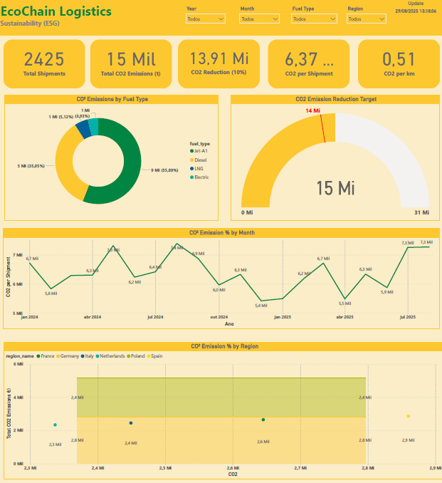

# EcoChain Logistics – Supply Chain & ESG Dashboard (Demo)

📊 **Overview**  
This project simulates a multinational logistics and supply chain company called **EcoChain Logistics**, using synthetic data on shipments, inventory, routes, suppliers, and emissions.  
The goal is to demonstrate expertise in **Power BI, ESG analytics, supply chain KPIs, and data storytelling**.

---

## 🚀 Features
- **Executive Overview**: Total Shipments, On Time %, Lead Time, Shipment Cost, CO2 Emissions.  
- **Logistics & Operations**: Performance by region, cost vs. lead time, transport mode analysis.  
- **Inventory & Demand**: Stock value, ABC classification, coverage days, inventory trends.  
- **Sustainability (ESG)**: CO2 emissions by transport mode, per shipment, and reduction targets.  
- **Finance & Suppliers**: Supplier volumes, cost per carrier, cost per shipment, detailed table.  

---

## 🛠️ Tech Stack
- **Power BI** (DAX, Power Query, data modeling)  
- **SQL / Excel** to simulate fact and dimension tables  
- **Geospatial mapping** with Azure Maps  

---

## 📂 Data Structure
- **Fact tables**: `fact_Shipments`, `fact_Inventory`, `fact_routes`, `fact_Emissions`  
- **Dimension tables**: `dim_Date`, `dim_Region`, `dim_Product`, `dim_Supplier`, `dim_Carrier`, `dim_hub`, `map_service_area`  
- **Measure tables**: `Measure_Financial`, `Measure_Inventory`, `Measure_Operational`, `Measure_Sustainability`, `Measure_Derive`  

---

## 🔗 Model Relationships (keys)
- `fact_Shipments[date_key]` → `dim_Date[date_key]`  
- `fact_Shipments[region_id]` → `dim_Region[region_id]`  
- `fact_Shipments[product_id]` → `dim_Product[product_id]`  
- `fact_Shipments[supplier_id]` → `dim_Supplier[supplier_id]`  
- `fact_Shipments[carrier_id]` → `dim_Carrier[carrier_id]`  
- `fact_Inventory[date_key]` → `dim_Date[date_key]`  
- `fact_Inventory[product_id]` → `dim_Product[product_id]`  
- `fact_Inventory[region_id]` → `dim_Region[region_id]`  
- `fact_routes[hub_id]` → `dim_hub[hub_id]`  
- `dim_Region[region_id]` → `map_service_area[region_id]` *(geospatial support)*  

---

## 📸 Preview
  
  

---

## 🎯 Key Learnings
- Applied **ESG reporting** integrated with supply chain KPIs.  
- Built **ABC inventory analysis** with Pareto thresholds (80/20).  
- Designed **route and hub mapping** for logistics flows.  
- Created **financial bridge** to analyze cost per carrier and supplier.  

---

## 📥 File
- [Download Dashboard PDF](./EcoChain-Logistics-BI-Dashboard.pdf)

---

## 👨‍💻 Author
**Leonardo Cabral** – Data Analyst | Power BI | SQL | SAP | Power Platform  
Certification in progress: **Microsoft PL-300**

